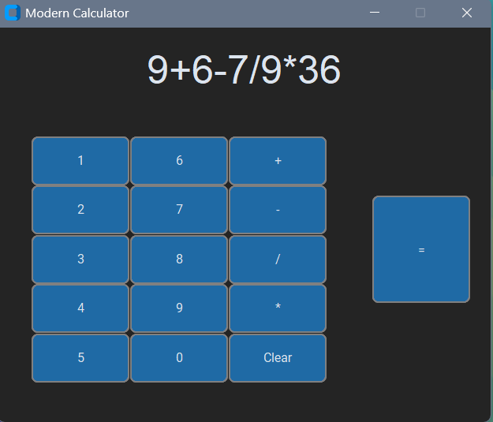

# Modern Calculator

A sleek, CustomTkinter-based calculator built in Python. Inspired by modern calculator designs, it supports basic arithmetic, keyboard input, and a clean GUI with outlined buttons.

## Features

- Basic operations: +, -, *, /

- Keyboard input support (0-9, +, -, *, /, Enter for =)

- Clear button to reset the screen

- Maximum of 21 characters on screen to prevent overflow

- Modern button design with outlines, hover effects, and fixed sizes

- Resizable font size for the display screen (Arial 40)

## Screenshots

## Installation

Clone this repository:

git clone https://github.com/CoolGuy158-Git/ModernCalculator/

Navigate to the project folder:

cd ModernCalculator

Create a virtual environment (optional but recommended):

python -m venv .venv

Activate the virtual environment:

Windows:

.venv\Scripts\activate

Mac/Linux:

source .venv/bin/activate

pip install customtkinter

Usage

Run the calculator with Python:

python ModernCalc.py

### CONTROLS
- Click the buttons or use the keyboard to input numbers and operations.

- Press Enter or = to calculate.

- Press Clear or the c key to reset the screen.

## Notes

- The calculator currently supports basic arithmetic only.

- Maximum characters on the screen is 21 to prevent overflow.

- The design uses CustomTkinter for a modern UI look.

## Future Improvements

**Add dynamic font resizing when the display reaches max characters**

**Add decimal point support and floating point calculations**

**Include keyboard shortcuts for Clear (Esc) and backspace**

**Add themes or blur background for a more modern Windows-like look**

